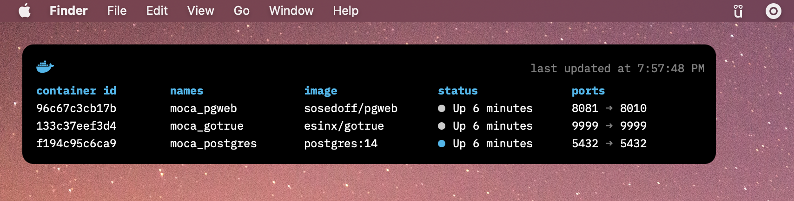

# Übersicht Docker Widget




## Installation

1. Install [Übersicht](http://tracesof.net/uebersicht/)
2. Clone this repository to your Übersicht widgets directory.
3. Customize the widget by editing the `index.jsx` file.

## Requirements

- [Docker](https://www.docker.com/)
- [IBM Plex Mono](https://fonts.google.com/specimen/IBM+Plex+Mono) font installed on your system (You can also change the font in the `index.jsx` file.)

## Customization

```js
export const command = "/usr/local/bin/docker ps"
export const refreshFrequency = 5000
```

- The `command` is the command that will be executed by Übersicht to get the output that will be displayed in the widget.
- The `command` by default uses the full path to docker since the widget's execution path doesn't include `/usr/local/bin` by default. You may have to customize the path to the `docker` executable in the `command` variable.
- Feel free to customize the `refreshFrequency` variable to change how often the widget is updated.

## License

MIT